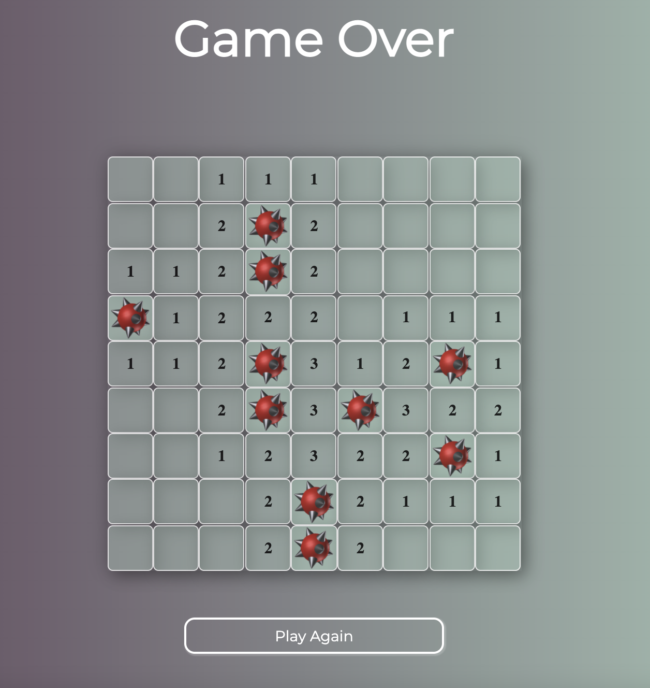

# Minesweeper Clone in Vanilla Javascript

This minesweeper clone was built while undertaking General Assembly’s Software Engineering Immersive Bootcamp. The purpose of the project was to deploy skills learnt during the HTML, CSS, and Javascript module of the course. The game retains the main aspects of the original, three game modes, a score calculator, and a choice of music. The game is designed to look good as well as functioning correctly by containing CSS animations and transitions, and is mobile responsive. The time frame for development was five days.

The game is deployed via GitHub Pages [here](https://mbaxendale22.github.io/SEI-Project-1/)

## Tech Stack 
* HTML
* CSS
* Vanilla Javascript
* Git & GitHub

## How to play 
The goal of minesweeper is to ‘clear’ all the mines on the board by marking them with a flag. Opening a cell containing a mine will result in an immediate loss. A cell will either show a number, which denotes how many adjacent cells contain mines, or it will be blank, denoting that none of its adjacent cells contain mines. If any of the adjunct cells are also blank, they will open automatically. This process will continue until an edge is hit or a numbered cell is hit, creating a cascade of self-opening cells. Left click to open a cell and right click to place (or remove)  a flag.  A user’s final score is calculated by weighting the time taken to clear the mines by the mine density of the difficulty level. 

## Game Snapshot 
Users are given a choice of game modes and three music genres: 


On selecting a game mode, users open cells and place flags: 


If a mine is clicked on, the game is over:



If all mines are successfully marked with a flag, the game is won and the user receives a score. 


## Featured Code Snippet
Each cell in the game is an instantiation of a Cell class, properties of which define the state of a given cell and methods define its behaviour. 
The clicked() method below handles the user left-clicking on a cell, it includes a recursive option should the correct condition 
be met (i.e., the cell is blank)

```javascript
 // main recursive function which handles showing correct numbers on mine-adjacent squares & auto-opening blank squares
      clicked() {
        this.gridPosition.style.animation = 'jello-horizontal .9s both'
        if (this.mine === 'on'){
          this.gridPosition.style.animation = 'shake-horizontal .8s cubic-bezier(.455,.03,.515,.955) both'
          this.state = 'clicked'
          this.gridPosition.style.backgroundColor = 'rgba(168, 202, 186, 0.8)'
          this.gridPosition.innerText = ''
          this.gridPosition.classList.add('mine')
          return
        }
        else if (this.number > 0) {
          this.state = 'clicked'
          this.gridPosition.innerText = this.number
          this.gridPosition.style.backgroundColor = 'rgba(168, 202, 186, 0.5)'
          return
        }
        // for any clicked cell, check only its surrounding cells then if any of those cells are 'unclicked' pass them back to the
        // the clicked method for checking. 
        else if (this.number === 0) {
          this.gridPosition.innerText = ''
          this.gridPosition.style.backgroundColor = 'rgba(168, 202, 186, 0.5)'
          this.surroundingCells.forEach(item => {
            if (item.state === 'unclicked') {
              item.state = 'clicked'
              item.clicked()
            }
            else {
              return
              }
          })

```


## Known Bugs 
* Not a bug but a missing feature from the original minesweeper is the ability to ‘peak’ at opening all adjacent cells by holding both left and right click down simultaneously. During development I didn’t know about this feature from the original game and subsequently could not implement it within the time-frame of the project. 

## Development Challenges & Wins

By far the most challenging aspect of developing this minesweeper clone was generating the cascade of self-opening cells. Developing this functionality easily took more time than any part of the game. In the end it was a great way to learn about recursive functions, about which I knew nothing at the outset. It was also a challenge to place constraints on which cells comprise a given cell’s adjacent field (cells which may contain mines or that should auto-open if they are blank) depending on where on the grid they appear (i.e. the first column of cells should not have cells to their immediate left in their adjacent cell fields; failure to properly impose these constraints either caused errors or resulted in the auto-opening cascade to fail to stop at edges.) Another challenge was offering three difficulty levels, defined by increased grid size and mine density. I enjoyed styling the game to give it a modern feel and adding responsive design features. Overall it was a really enjoyable way to deepen my javascript skills at the outset of my learning journey.  
